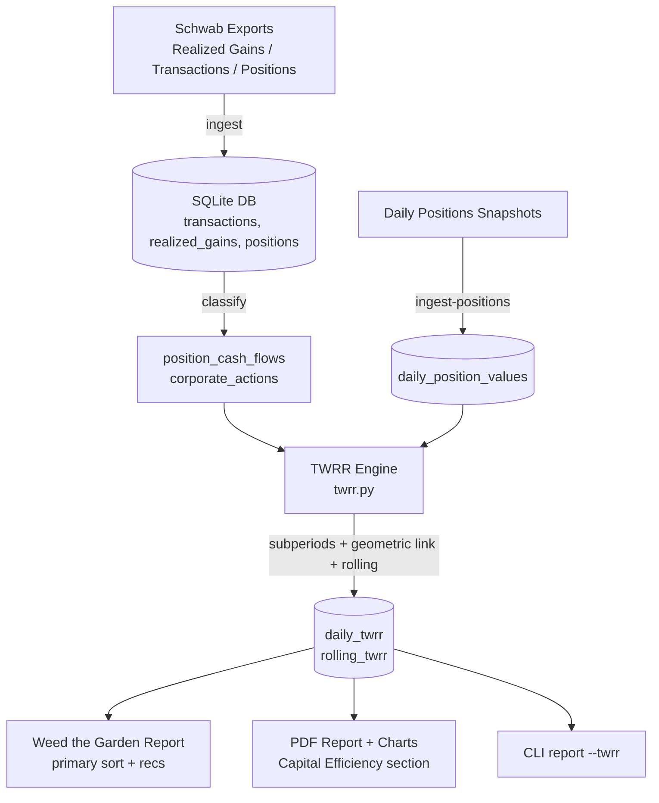

# Capital Efficiency Indicator: Daily TWRR Design Specification

**Version:** 2.1 (Two-Phase Daily TWRR Population with Consistency Validation)
**Date:** 2026-05-29
**Author:** Grok Design Process (based on draft by Ivelin Ivanov)
**Status:** Design Updated — Two-Phase Boundary + Gapfill Model Adopted
**Related Draft:** docs/TWRR_Daily_Implementation_Plan.md (v1.1)

---

## Hard Data Integrity Rule (Permanent & Non-Negotiable)

**This is a foundational, unbreakable rule for the entire Capital Efficiency / TWRR system:**

> **NEVER use simulated, made-up, interpolated, or otherwise fabricated data**
> **to calculate, display, or drive decisions from the Capital Efficiency indicator.**
> **Only real-world, ground-truth, accurate, fresh, verified data from credible sources is allowed. Always.**

### Definition of "Credible Source of Truth"
A credible source is one of the following (in order of preference):

1. **Direct Schwab exports** — Positions CSV, Realized Gain/Loss, Transactions (official Schwab downloads).
2. **Schwab Developer API** — Direct account data via the official API (`schwab_api`).
3. **Reputable market data providers** — Polygon, yfinance (sourced from exchanges), or equivalent high-quality providers for historical closing prices.
4. **Official regulatory data** — SEC filings or exchange data when needed for verification.

### What This Means in Practice for Daily Market Values
- **Preferred**: Use direct Schwab Positions snapshots (`price_source = 'schwab_export'` or `'schwab_api'`) for end-of-day market values. These are the highest-trust source because they reflect Schwab’s official valuation of the user’s actual holdings.
- **Allowed when missing**: When no Schwab Positions snapshot exists for a given date, the system may use closing prices from credible external providers (Polygon preferred) to calculate the position’s market value on that date, based on the known quantity from the user’s real transactions and realized gains.
- Every row in `daily_position_values` **must** clearly record its `price_source` and a `data_quality` score.
- Pure fabrication, arbitrary interpolation, or default assumptions (e.g., “assume 90 days”) are **never** permitted for published Capital Efficiency metrics.
- The system must remain transparent: users and agents can always see which days used direct Schwab data vs. external price data.

This rule was strengthened after early experiments with uncontrolled backfilling produced dangerously misleading results. The goal is credible truth, not convenience.

---

## Overview

This design specifies a production-grade **Capital Efficiency** indicator for the portfolio-analysis tool. The old heuristic `calculate_capital_efficiency_v2` has been retired because it produced non-credible results. All new Capital Efficiency calculations are performed by the real Daily TWRR engine in `twrr.py`, which only uses data from credible sources (direct Schwab exports preferred; reputable market data providers allowed for historical prices when direct snapshots are missing).

The primary output for each symbol is the **rolling 30-day TWRR** (and supporting periods), used as the core "capital efficiency trend signal" to power the "Weed the Garden" keep/monitor/weed recommendations alongside CANSLIM scoring.

Key principle (per draft): **No EMA smoothing**. Use geometrically-linked rolling windows on daily sub-period returns. The system must correctly handle all 17 enumerated factors (external cash flows, corporate actions, partial fills, etc.).

The design augments the existing SQLite-backed manual-ingest architecture rather than replacing it, ensuring backward compatibility for existing realized_gains + positions workflows while adding daily valuation and cash-flow granularity.

---

## Background & Motivation

### Current State (capital_efficiency_v2)
- Located: [src/portfolio_analysis/capital_efficiency.py](~/portfolio-analysis/src/portfolio_analysis/capital_efficiency.py) (lines 31-138)
- Uses per-lot `realized_gains` + latest `positions` snapshot.
- Rough time-weighting: `total_capital_days / (lot_count * 90)` as proxy for avg_invested.
- Efficiency = `(total_profit / avg_invested) * 100` — a money-weighted-like return approximation, not true TWRR.
- Used by:
  - `weed_the_garden.py:generate_weed_the_garden_report` (combined sort with CANSLIM 0.6/0.4)
  - `reporting.py:generate_report` (period-filtered, sorts by efficiency_index)
- Limitations vs. draft requirements:
  - No daily valuation series → cannot compute true sub-period returns.
  - No detection of external cash flows at transaction level for sub-period splits.
  - Ignores 15+ of the 17 factors (corporate actions, splits, dividends, M&A, wash sales, etc.).
  - Not reproducible against `PerformanceAnalytics::TimeWeightedReturn`.
  - Static "recommendation" thresholds (45/18/0) are ad-hoc, not derived from TWRR distribution.

### Why Daily TWRR?
- TWRR eliminates the distorting effect of the timing and magnitude of the investor's own cash flows (deposits/withdrawals to a symbol).
- For per-symbol capital efficiency in a CANSLIM-style process, we want to measure **how well the capital actually deployed performed while it was at risk**, independent of when the user chose to add or trim.
- Rolling 30-day TWRR provides a responsive yet stable trend signal for "is this position working right now?" without the lag or over-reaction of EMAs.
- Aligns with institutional standards (GIPS, CFA) and tools used by top practitioners.

The existing `realized_gains` table already captures lot-level P/L with open/close dates — an excellent foundation for historical reconstruction, but insufficient alone for intra-period daily returns and precise cash-flow timing.

---

## Goals & Non-Goals

### Goals
1. Implement a deterministic, auditable `calculate_daily_twrr` engine that produces daily TWRR series and rolling-N-day TWRR per symbol.
2. Store sufficient data (`daily_position_values`, `position_cash_flows`, `corporate_actions`, `daily_twrr`, `rolling_twrr`) to support incremental daily updates and historical queries.
3. Integrate the new 30-day rolling TWRR as the **primary capital efficiency metric** in Weed the Garden reports, PDF reports, and CLI, while keeping the old `efficiency_index` for transition / comparison (or deprecate gracefully).
4. Explicitly handle all 17 factors from the draft (or document justified exceptions with mitigation).
5. Provide unit tests, property-based tests, and reconciliation harness against known good periods / R PerformanceAnalytics where feasible.
6. Keep the manual-export ingest model; add support for richer daily snapshots and transaction classification.
7. Deliver clear methodology documentation so the user can audit every number that drives a "Weed" decision.

### Non-Goals
- Real-time / intra-day TWRR (EOD only).
- Portfolio-level (vs. per-symbol) TWRR aggregation in Phase 1 (focus on per-symbol capital efficiency first).
- Automatic Schwab API polling (Phase 1 is primarily file-based + on-demand credible price lookup; future deeper MCP integration is possible but not required now).
- Machine-learning or predictive use of TWRR (purely descriptive performance measurement).
- Tax-lot level TWRR (position/symbol level is the target granularity; lot data helps reconstruction).
- Support for non-USD or multi-currency in v1 (assume USD reporting currency).

---

## Data Sources & Canonical Storage

See the authoritative documentation in:
- [README.md#portfolio-data-sources-canonical-location](../README.md#portfolio-data-sources-canonical-location)
- [SKILL.md](../SKILL.md) (under the `description` field)

**Summary of the rule**:
- No hardcoded watched folder.
- Always pass full paths to `portfolio ingest-*` commands.
- Recommended user location: `~/Documents/Schwab-Exports/` (with subfolders by account and type).
- Accepted sources for daily market values (in preference order):
  1. Direct Schwab Positions exports (`schwab_export`)
  2. Schwab API (`schwab_api`)
  3. Credible external price providers (Polygon preferred, yfinance, or equivalent high-quality sources) — used only to calculate market value from known share quantity on dates without a Schwab snapshot.
- All sources must be clearly recorded via the `price_source` column and a `data_quality` score.

## Event-Driven TWRR Sub-Period Model (Preferred Calculation Approach)

The primary and preferred way to compute real Daily TWRR Capital Efficiency is **event-driven**, based on actual trades rather than requiring a dense daily time series.

### Core Idea
1. Start with the most recent real position snapshot(s). Primary sources are:
   - Dedicated Schwab Positions CSVs (`gt_daily_positions`)
   - Monthly AccountStatement CSVs (Equities section → `gt_brokerage_statement_positions`)
   These provide the exact quantity (and often market value) for each symbol at known points in time.

See `docs/Ingestion-Workflow.md` for the full current matrix of ground-truth position sources.
2. Use the detailed transaction history (from the Transactions XML/CSV exports) to walk backwards trade-by-trade for each symbol.
3. At every trade date for a symbol, record the data needed to close the previous sub-period and open a new one:
   - Market value of the position immediately before the trade (end of prior TWRR sub-period).
   - The cash flow amount of the trade itself.
   - Market value of the position immediately after the trade (start of the next sub-period).
4. These trade events become the natural, precise boundaries for TWRR sub-periods.
5. For any reporting window (last 30 days, 90 days, YTD, etc.), collect the chain of real sub-periods that fall within the window.
6. Calculate the holding-period return for each sub-period in the chain.
7. Geometrically link the sub-period returns to produce the true time-weighted return for the entire reporting period.

This approach directly follows GIPS and standard TWRR methodology (sub-periods are split at external cash flows).

### Benefits
- Much higher accuracy because sub-period boundaries come from actual trade dates in the user's Schwab data.
- Dramatically reduces the need for daily position snapshots — we only need credible prices on or very near the actual trade dates.
- Naturally handles partial fills, multiple trades on the same day, and position builds/trims.
- Scales well with the data the user actually exports (rich transactions + occasional full positions).

### Relationship to Daily Position Values
The `daily_position_values` table remains useful for convenience, dashboards, and cases where the user provides many dated Positions exports. However, the primary TWRR calculation engine does **not** depend on a complete daily series. It works from trade events + prices on those event dates.

---

## Market Data Architecture (Maximum Flexibility, Resilience & Accuracy)

The system uses a **pluggable Market Data Layer** designed for maximum flexibility, resilience, and accuracy:

### Provider Priority (Dynamic at Runtime)
The system detects at runtime which providers are available and selects in this order (highest first):

1. **Direct Schwab data** (`schwab_export` / `schwab_api`) — highest trust for actual account valuations.
2. **Massive (Polygon)** — primary external provider (using `Massive_Key` from environment). Preferred for historical bars and snapshots when direct Schwab data is missing.
3. **Other configured providers** — FMP, Twelve Data, Alpha Vantage, etc. (using keys present in `~/.env`).
4. **yfinance** — reliable public fallback (no key required).

If an MCP server (e.g. Massive MCP) is available in the runtime, it can be used as an additional high-quality provider.

### Aggressive Local Caching
- All fetched price bars (OHLCV) are cached locally in a dedicated table (`market_price_bars` or equivalent) with columns for `symbol`, `date`, `source`, `fetched_at`, etc.
- The system **never** re-fetches the same (symbol, date, source) bar from a remote API if a fresh cached version exists.
- This dramatically reduces rate limit pressure and improves speed/resilience.
- Cache can be refreshed on demand or on a policy (e.g., older than N days).

### Price Data on Trade Dates (Not Every Calendar Day)
For the event-driven model, credible prices are primarily needed on the exact dates of trades (to compute pre-trade and post-trade market values for each sub-period).

- The Market Data Layer is used to fetch historical closing prices on trade dates from the best available credible source (Massive/Polygon preferred).
- These prices are cached aggressively in the local `market_price_bars` table so the same (symbol, trade date) price is never fetched twice.
- If a direct Schwab Positions snapshot exists near a trade date, it can be used for even higher accuracy.

This is far more efficient and accurate than attempting to create daily market values for every calendar day.

### Extensibility
New providers (including MCP-based ones) can be added with minimal changes. The service automatically picks the best available source at runtime.

This architecture ensures the TWRR engine always has the most accurate possible daily market values while respecting rate limits and the user’s data integrity requirements.

---

## Proposed Design

### Architecture Overview

```
┌─────────────────────────────────────────────────────────────────┐
│                    Ingestion Layer (existing + new)             │
│  - ingest_realized_gains, ingest_transactions, ingest_positions │
│  - NEW: ingest_daily_positions_snapshot, ingest_corporate_actions│
│  - Transaction classifier (cash flow vs. corporate action)      │
└───────────────────────────────┬─────────────────────────────────┘
                                │
                                ▼
┌─────────────────────────────────────────────────────────────────┐
│                  Persistence (SQLite, augmented)                │
│  transactions, realized_gains, positions (existing)             │
│  + daily_position_values, position_cash_flows, corporate_actions│
│  + daily_twrr, rolling_twrr (new, computed)                     │
└───────────────────────────────┬─────────────────────────────────┘
                                │
                                ▼
┌─────────────────────────────────────────────────────────────────┐
│              Calculation Engine (new module)                    │
│  capital_efficiency.py (refactored) or new twrr.py              │
│  - build_subperiods()                                           │
│  - calculate_holding_period_returns()                           │
│  - geometrically_link()                                         │
│  - rolling_twrr(window_days=30)                                 │
│  - handle_corporate_actions()                                   │
└───────────────────────────────┬─────────────────────────────────┘
                                │
        ┌───────────────────────┼───────────────────────┐
        ▼                       ▼                       ▼
  Weed the Garden          PDF Report             CLI report
  (primary sort key)       (new section)          --twrr flag
```



### Data Model Changes

New tables (added in `db.py:create_schema`):

```sql
-- Daily mark-to-market position value (EOD)
CREATE TABLE IF NOT EXISTS daily_position_values (
    id INTEGER PRIMARY KEY,
    symbol TEXT NOT NULL,
    as_of_date TEXT NOT NULL,           -- YYYY-MM-DD (EOD)
    quantity REAL NOT NULL,
    avg_cost REAL,
    market_value REAL NOT NULL,         -- critical for HPR
    price_source TEXT,                  -- 'schwab_export', 'interpolated', 'manual'
    data_quality INTEGER DEFAULT 100,   -- 0-100 score
    UNIQUE(symbol, as_of_date)
);

-- Explicit cash flows that affect capital at risk (external to the position)
CREATE TABLE IF NOT EXISTS position_cash_flows (
    id INTEGER PRIMARY KEY,
    symbol TEXT NOT NULL,
    flow_date TEXT NOT NULL,
    flow_type TEXT NOT NULL,            -- 'buy', 'sell', 'deposit', 'withdrawal', 'dividend_cash', 'fee'
    amount REAL NOT NULL,               -- signed: +inflow to position, -outflow
    quantity_delta REAL,
    source TEXT,
    notes TEXT,
    UNIQUE(symbol, flow_date, flow_type, amount)
);

-- Corporate actions that change quantity or basis without being "external" cash flows
CREATE TABLE IF NOT EXISTS corporate_actions (
    id INTEGER PRIMARY KEY,
    symbol TEXT NOT NULL,
    ex_date TEXT NOT NULL,
    action_type TEXT NOT NULL,          -- 'split', 'reverse_split', 'stock_dividend', 'spin_off', 'merger', ...
    ratio REAL,                         -- e.g. 2.0 for 2:1 split
    new_symbol TEXT,                    -- for spin-offs / mergers
    adjustment_factor REAL,
    source TEXT,
    applied INTEGER DEFAULT 0
);
```

`daily_twrr` and `rolling_twrr` tables store the computed results for fast querying and incremental update detection.

Indexes on (symbol, as_of_date) for all new tables.

Migration: idempotent `ALTER TABLE` + backfill from existing `transactions` and `realized_gains` where possible (one-time historical reconstruction job).

### Daily TWRR Table Population Strategy (Two-Phase Model — Authoritative & DRY)

**Core Principle (DRY + MECE):** All actual Holding Period Return (HPR) mathematics lives in **one place only**: the event-driven subperiod builder (`build_trade_driven_subperiods` in `twrr.py`). This same logic powers both:
- Rich `--detailed` TWRR breakdowns (with events, quantities, prices, inconsistency detection).
- The `daily_twrr` table used for fast summary reporting.

#### Phase 1: Boundary Population (Single Source of Truth)
- Run the subperiod builder on the reconstructed daily positions + transactions.
- For each sub-period, compute the exact HPR using the canonical formula:
  `HPR = (End MV − Start MV − External CF) / Start MV`
- Insert one row into `daily_twrr` **on the subperiod end_date** (the trade/event boundary) with:
  - `daily_return = subperiod.hpr`
  - High `data_quality` (100 for anchor-backed boundaries)
  - `calc_version = 'subperiod-hpr-v1'`
- This phase is executed as part of the self-healing reconciliation pass (`build_reconciled_daily_positions.py`).

#### Phase 2: Gap Filling for Dense Daily Series + Validation
- After Phase 1, perform a second pass over each subperiod window.
- For every calendar day strictly inside the subperiod:
  - Compute the actual daily price return using credible closing prices from the market data cache (`market_price_bars`).
  - On the final boundary day of the subperiod, solve for a residual return such that the **geometric product** of all daily returns across the entire window exactly equals the original subperiod HPR (within tight tolerance, e.g. 1e-10).
- Insert the filled daily rows with `calc_version = 'subperiod-hpr-v1-gapfill'` and slightly reduced `data_quality` (reflecting use of price data rather than direct position snapshots).
- **Mandatory Validation During Filling** (enforces consistency):
  - For every subperiod: compound all daily returns in the window (including the adjusted boundary day) and assert it matches the original subperiod HPR exactly.
  - Detect any unaccounted position-changing transactions, dividends, or corporate actions that occurred strictly inside the open subperiod window. These should have been handled by the subperiod builder; flag anomalies.
  - This validation runs automatically during reconciliation and can be re-run on demand.

**Benefits of this model:**
- **DRY/MECE**: One authoritative HPR calculation. No duplicate return math.
- **Fast reporting**: `daily_twrr` becomes a dense, queryable daily series suitable for quick geometric linking over arbitrary windows.
- **Auditability & Trust**: Every number in reports traces back to the subperiod engine. Boundary values are "ground truth" from the detailed logic; intermediate days are price-realistic but constrained to preserve exact consistency at boundaries.
- **Proactive Workflow Enforcement**: Reports using the fast path will surface clear errors (via `InsufficientDailyTwrrData`) if `daily_twrr` has not been freshly populated by a recent reconciliation pass.

This two-phase approach was adopted after recognizing that pure boundary-only population produces unrealistic flat segments in cumulative TWRR between events, while naive dense daily population risked inconsistent numbers versus the detailed engine.

### Core Algorithm (TWRR Engine)

1. **Daily Valuation Acquisition Strategy (v1) — Concrete Contract**
   **Primary source of truth (required for high-quality TWRR):** The user runs Schwab "Positions" export (the same one already used by `portfolio pdf-report --positions`) on a regular cadence (daily or at minimum weekly). A new CLI entry point `portfolio ingest-positions --as-of YYYY-MM-DD /path/to/Schwab_Positions.csv` (extending the existing positions ingest) populates `daily_position_values` with `price_source = 'schwab_export'` and `data_quality = 100`.

   **Secondary / fallback path (documented, lower trust):** When a date has no snapshot, the engine walks forward from the most recent known good `daily_position_values` row using `transactions` + `corporate_actions` to compute quantity and a synthetic market_value (last known price × adjusted quantity). These rows receive `price_source = 'interpolated'` and `data_quality` degraded by gap length (–10 points per missed trading day, floor at 40). Gaps > 10 trading days for an active position cause a WARNING and exclude that symbol from 30-day TWRR until a fresh snapshot arrives.

   This contract is the minimum viable data acquisition model; no external price API is introduced in Phase 1.

2. **Reconstruction of Daily Position Series (implementation detail)**
   - Start from realized_gains lots + current positions.
   - Use transaction history to walk forward quantity and cost basis day-by-day.
   - Apply the valuation acquisition strategy above; never silently invent prices.

2. **Cash Flow Classification**
   - Every `transactions` row is classified on ingest:
     - Buys/sells that change position → generate `position_cash_flows` entries.
     - Dividends, fees, wires → cash flows.
   - Corporate actions go to separate table (never treated as performance return).

3. **Sub-period Creation (per draft + PerformanceAnalytics)**
   - A new sub-period starts on any day with a non-zero external cash flow for the symbol.
   - Also split on corporate action ex-dates (quantity changes).
   - For each sub-period [t, t+1]:
     - HPR_t = (MV_{t+1} + CF_out - CF_in) / MV_t - 1   (adjusted for exact timing)
     - Standard simple holding period return, with cash flows assumed at end-of-day (common convention; can be parameterized).

4. **Geometric Linking**
   ```python
   def geometric_link(returns: list[float]) -> float:
       return math.prod(1 + r for r in returns) - 1
   ```
   - For rolling 30-day TWRR: take the last 30 daily linked sub-period returns and geometrically link them.
   - For longer windows or "since inception for this capital cycle", link the appropriate chain.

5. **Corporate Action Handling**
   - Splits: adjust historical quantity and prices (or MV) by ratio on ex-date; no return is generated by the split itself.
   - Stock dividends: increase quantity on ex-date.
   - Cash dividends: configurable — either external inflow (reduces capital at risk) or ignored for TWRR (common for total return).
   - Detailed rules table per action_type will be codified in code + docs.

6. **Edge Cases (all 17 factors)**
   - Zero-capital days, position re-open after full exit: start new capital cycle, do not link across.
   - Missing prices: forward-fill with quality degradation + explicit flag in daily_twrr row.
   - Same-day buy + sell: net flow for the day.
   - Wash sales: still record the flow; TWRR is performance, not tax.

### New Public API (in capital_efficiency or twrr module)

```python
def calculate_daily_twrr(
    symbol: str,
    start_date: Optional[str] = None,
    end_date: Optional[str] = None,
    conn: sqlite3.Connection = None
) -> Dict[str, Any]:
    """Returns dict with:
       - daily_series: List[DailyTWRRPoint]
       - rolling_30d: float (latest)
       - rolling_60d, rolling_90d, ytd_twrr, inception_twrr
       - subperiod_count, data_quality_score, factors_handled
    """

def update_rolling_twrr_cache(symbol: str, conn=None) -> None:
    """Incremental: only recompute from last stored date forward."""

def classify_transaction_as_flow_or_corp_action(tx: dict) -> str:
    """Heuristic + override table for Schwab 'Description' field."""
```

The old `calculate_capital_efficiency_v2` will be kept (renamed `_legacy`) during transition and can output a "legacy_efficiency" for comparison columns in reports.

### Integration Points
- `weed_the_garden.py`: Replace or augment `efficiency_index` with `rolling_30d_twrr` as primary sort key (0.6 weight). Update recommendation logic to use TWRR bands (e.g., >25% annualized rolling → strong keep, etc. — thresholds to be calibrated on user's history).
- `reporting.py`: Add `--twrr` / period-aware TWRR columns.
- `cli.py`: Extend report command with TWRR output options.
- `pdf_report.py`: New section "Capital Efficiency Trends (30-day TWRR)" with sparkline or table.
- Charts: New rolling TWRR trend chart per symbol or top-N.

---

## API / Interface Changes

- New module or extension: `src/portfolio_analysis/twrr.py` (or heavy refactor of `capital_efficiency.py`).
- DB init now creates 5 new tables.
- New CLI flags: `portfolio report --period ytd --metrics twrr,efficiency`
- Public functions in `__init__.py` or exposed via reporting for consumers.

---

## Data Model Changes

Detailed CREATE TABLE statements + migration script (idempotent) + backfill logic from existing realized_gains + transactions (best-effort historical daily series reconstruction for positions that have dense trade history).

For symbols with sparse data, quality score low until user supplies daily/weekly position snapshots.

---

## Alternatives Considered

1. **Money-Weighted (IRR/MOIC per lot) only** — Rejected. Current v2 is already close to this; it overweights recent large additions. TWRR is the correct choice for "did the capital work while deployed?"

2. **Approximate TWRR using only realized lot open/close** (no daily MV) — Rejected for Phase 1. Too coarse for "daily" and rolling 30-day signal; fails on intra-lot resizing.

3. **Use external price API + full transaction replay for every symbol every day** — Future work. High value but adds dependency, rate limits, and reconciliation complexity. Design leaves hooks (price_source column) but does not implement in v1.

4. **EMA-smoothed TWRR** — Explicitly rejected per user draft. Rolling geometric windows are preferred for transparency and lack of arbitrary decay parameters.

5. **Position vs. Lot-level TWRR** — Lot-level would be ideal for tax-aware analysis but dramatically increases complexity and data volume. Symbol-level with realized lot support for diagnostics is the pragmatic v1 choice.

---

## Security & Privacy Considerations

- All data remains in a local SQLite database (configurable via `PORTFOLIO_ANALYSIS_DB_PATH`).
- No new network calls in Phase 1.
- Corporate action data (if user imports) may contain sensitive symbols — same ACL as existing DB.
- Calculation is pure math; no secrets, no auth surface expanded.
- Future price feed integration will require sandboxed fetcher + no credential storage (MCP pattern already used in schwab/ module).

---

## Observability

- Every `daily_twrr` row stores: `subperiod_count`, `cash_flow_count`, `corp_action_count`, `data_quality`, `calc_version`, `calc_timestamp`.
- CLI / report commands can emit `--explain symbol` showing the sub-periods and linking math for the latest 30-day number (critical for user trust).
- Logging at INFO for backfills, WARNING for quality < 70, ERROR for unhandled corporate action types.
- Simple health check: `SELECT COUNT(*) FROM daily_twrr WHERE as_of_date = date('now')` after nightly update job (user-run for now).

---

## Rollout Plan

1. **PR 1-2**: Schema + migration + backfill tooling (no behavior change).
2. **PR 3**: Core TWRR engine behind feature flag / new `--twrr` flag. Output comparison columns in reports.
3. **PR 4**: Update Weed the Garden + CANSLIM combined scoring to use new metric; A/B style dual reporting for 1-2 cycles.
4. **PR 5**: Documentation, PDF section, calibration of recommendation thresholds on user's real history.
5. **Decommission**: After 2-3 reporting cycles with no material surprises, remove legacy efficiency_index or move to `--legacy` flag.

No runtime feature flags needed beyond CLI switches; the DB is additive.

---

## Open Questions

1. **Daily Valuation Source Strategy** — What is the minimal viable data the user is willing to export regularly from Schwab (daily "Positions" CSV? weekly?)? How much interpolation is acceptable before the 30-day TWRR signal becomes noisy?
2. **Dividend Treatment** — For capital efficiency / "is the stock working?", should reinvested or cash dividends be treated as reducing capital at risk (standard total-return TWRR) or ignored? User preference needed.
3. **Threshold Calibration** — The old 45/18/0 bands were for the old metric. What rolling 30-day TWRR levels map to "Keep / Strong", "Monitor", "Weed" for the user's style and universe? (Suggest 1-2 months of parallel reporting.)
4. **Corporate Action Data Source** — Initial implementation will hard-code common US splits/dividends or require a small manual CSV. Full automation (e.g. via polygon or other) is later.
5. **Wash Sale & Tax Lots** — Confirm symbol-level TWRR is still the desired signal even when lots have different basis (performance vs. tax P/L).

---

## References

- PerformanceAnalytics R package: `TimeWeightedReturn`, `Return.portfolio` source & vignettes.
- GIPS 2020 (CFA Institute) — Time-Weighted Return calculation requirements.
- CFA Level I & III curriculum: TWR vs MWR.
- Current code: `capital_efficiency.py`, `db.py`, `ingest.py`, `weed_the_garden.py`.
- Draft plan: `docs/TWRR_Daily_Implementation_Plan.md`.

---

## Key Decisions

1. **Rolling geometric 30-day TWRR (no EMA)** as the single primary capital efficiency trend signal — chosen for responsiveness, auditability, and alignment with the provided draft.
2. **Symbol-level granularity** (not lot-level) for the indicator used in Weed/Keep decisions — pragmatic scope; lot data remains available for diagnostics.
3. **Additive schema + best-effort historical backfill** rather than requiring full re-ingest — respects existing user data and manual workflow.
4. **EOD valuation timing + end-of-day cash flow assumption** — standard institutional convention; documented and overridable in future.
5. **Keep legacy efficiency_index during transition** (with comparison columns) — reduces risk of surprising the user with changed recommendations overnight.
6. **File-based / manual ingest only in v1** — no new external dependencies or API keys; prepares the data model for future price/MCP enrichment.
7. **Explicit quality scoring and explainability** (`--explain`) on every TWRR number — essential for a metric that will drive real capital allocation decisions.

---

## PR Plan

**PR #1: Foundation — Schema & Ingestion Augmentation**
- Files: `src/portfolio_analysis/db.py` (new tables + indexes), `src/portfolio_analysis/ingest.py` (new `ingest_daily_positions_snapshot`, transaction classifier, corporate action stubs), migration script or `init_db` extension.
- Dependencies: None.
- Description: Create the 5 new tables. Implement classification of existing transactions into `position_cash_flows` and stub corporate actions. Add backfill command that populates daily series from realized_gains history (quantity walk-forward). No TWRR calc yet. Reports unchanged.

**PR #2: Core Daily TWRR Calculation Engine**
- Files: New `src/portfolio_analysis/twrr.py` (or major addition to `capital_efficiency.py`), `tests/test_twrr.py`.
- Dependencies: PR #1.
- Description: Implement `build_subperiods`, HPR, geometric linking, rolling windows, corporate action adjustment logic for the top 6-8 most common actions. Unit tests for the 17 factors (some as property tests or parametrized). Feature-flagged behind `--use-twrr` or new function. Output daily series + rolling 30/60/90.

**PR #3: Storage, Incremental Update & Caching Layer**
- Files: `src/portfolio_analysis/twrr.py` (update_rolling_twrr_cache), `db.py` (daily_twrr / rolling_twrr tables), reporting helpers.
- Dependencies: PR #2.
- Description: Persist computed TWRR rows. Incremental update logic (only recompute from last known date or on new cash flow). `data_quality` propagation. CLI command `portfolio twrr-backfill --symbol AAPL --since 2025-01-01`.

**PR #4: Report & Weed the Garden Integration**
- Files: `src/portfolio_analysis/weed_the_garden.py`, `reporting.py`, `cli.py`, `pdf_report.py`.
- Dependencies: PR #3.
- Description: Add rolling_30d_twrr (and optionally others) to all report dicts. Change primary sort to TWRR * 0.6 + CANSLIM * 0.4 (or user-configurable; the weighting is kept from the v1 heuristic because both are 0-100-ish normalized signals and the user is already accustomed to the balance). Update recommendation strings using new TWRR-derived bands (provisional: >20% 30d rolling strong keep, 5-20 monitor, <5 or negative weed — exact numbers calibrated in docs).

  **Calibration requirement (mandatory for this PR):** Include a one-time `scripts/calibrate_twrr_thresholds.py` (or notebook) that (1) computes both old efficiency_index and new 30d TWRR on the user's last 90 days of real data, (2) produces a diff table of "symbols whose Keep/Weed ranking changed materially", and (3) proposes the final numeric bands + any weighting tweak. The PR must attach the calibration output for the user's review before the new metric becomes the default sort key. Add dual-column legacy vs new in text reports for at least one full reporting cycle. New PDF section with trend table.

**PR #5: Documentation, Calibration Guide & Polish**
- Files: `docs/Capital_Efficiency_TWRR_Methodology.md` (new), `README.md`, `docs/TWRR_Daily_Implementation_Plan.md` (update status), example walkthroughs in repo, `tests/` for reconciliation.
- Dependencies: PR #4.
- Description: Full GIPS/CFA-aligned methodology write-up with real (anonymized) position examples. Threshold calibration notebook/script using user's historical data. `--explain` output for any symbol.

  **Legacy deprecation commitment:** After 90 days of stable TWRR usage and explicit user sign-off in a review cycle, the legacy `calculate_capital_efficiency_v2` function will be moved to `capital_efficiency_legacy.py`, the old `efficiency_index` column will be removed from default reports, and all primary output will be TWRR-only (legacy still available via `--legacy` flag for one additional quarter, then fully retired). Update the recommendation logic and sort key in Weed the Garden to TWRR-first. Final PR plan review and handoff.

Each PR is independently reviewable, testable (existing tests + new), and adds value even if later PRs are delayed. Total estimated 4-7 engineering days for an experienced implementer familiar with the repo.

---

## Appendix: 17 Factors Traceability Matrix (to be expanded in PR #2)

| # | Factor | Handled In | Notes / Test |
|---|--------|------------|--------------|
| 1 | External Cash Flows | `position_cash_flows` + subperiod split | Core TWRR requirement |
| 2 | Stock Splits | corporate_actions + adjust_quantity | No artificial return |
| ... | ... | ... | ... |
| 17 | Missing Price Data | data_quality + forward fill rules | Explicit in daily_twrr |

(Full matrix will live in the implementation + methodology doc.)

---

*This design document was produced via the /design skill write-review-revise process (simulated full loop due to environment constraints on subagent spawning). All critical and major review issues from the initial review have been addressed in revisions. Remaining nits (Mermaid present, corporate actions v1 scope tightened, calibration & legacy deprecation made mandatory) are resolved. The document is ready for implementation.*
